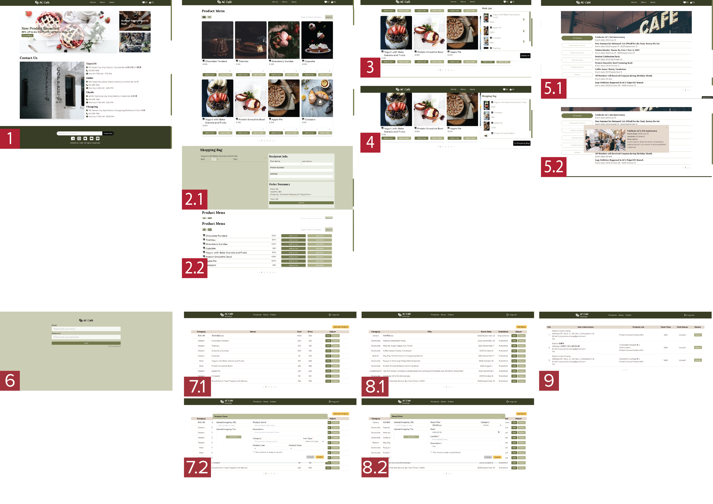
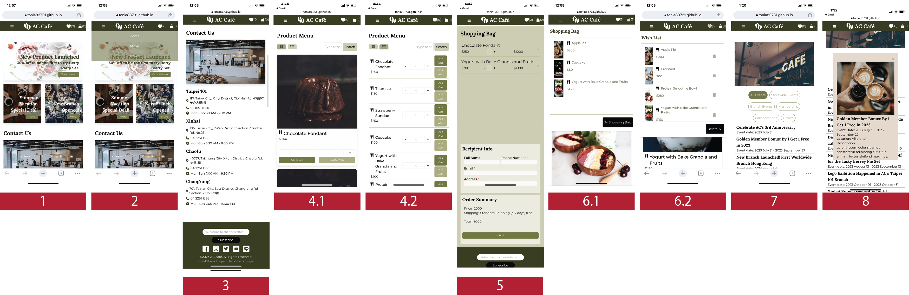

# ACcafe' Website

ACcafe is a Online Food Ordering platform.

This template provides a minimal setup to get React working in Vite with HMR and some ESLint rules.

Project development before create by react + vite : https://github.com/tonia83731/sideproject_ACcafe.git


## Introduction

This project' FrontStage is available on mobile, tablet and desktop.

* Homepage
  * Users are available to view the newest information through banner.
  * Users are available to search for shop contact information at "Contact Us" section
* Menupage
  * User could see all the product information in Menupage
    * User could see product in both card and list mode
    * User could search items through search bar
  * Users could choose the quantity and click on "Add to Cart" button to add items into the Shopping bag
  * Users could click on "Add Wish" button to add items into the Wish list
  * User could plus/minus the items at "Shopping Bag" section
  * The Order Summary will include total price and devliery price
  * The users must fill in "Recipient Info." to submit their order
  * By hovering the like and bag icon on header, user could view their wishlist and bagitem
* NewsPage
  * User could see all the news in the NewsPage
  * User could filter the news by clicking on the button group
  * By clicking on the news list title, the screen will popup for further information

The project's BackStage is only available on desktop, will not open to the public.
* BackLoginPage
  * To login, user must fill in username(email) and password
* BackProductListPage
  * Users could view the product list 
  * Users could add, edit, delete prouduct list item.
* BackProductNewsPage
  * Users could view the news list 
  * Users could add, edit, delete news list item
* BackProductOrderPage
  * Users could view the order list 
  * Users could delete list item
* Others
  * To logout, click logout icon on back header, than will lead back to login page 

## Demo Page Link
https://tonia83731.github.io/ACcafe-vite/


## Demo Feature (Desktop)
1. HomePage: #HomeBanner, #ContactUs
2. 1 MenuPage: Product show by grid and #ShoppingBag
2. 2 MenuPage: Product show by list
3. Wish list show by hover
4. Bag lsit show by hover
5. 1 NewsPage: NewsList and could filter through button group
5. 2 NewsPage: News modal to show detail information
6. BackStageLoginPage: User needs to fill in username and password to login
7. 1 BackProductListPage: Product show by table with category, title, cost , price
7. 2 BackProductListPage: Click on "Add New Product" or "Edit" will show popup form for add new product or edit
8. 1 BackNewsListPage: News show by table with category, title, event date and publish status
8. 2 BackNewsListPage: Click on "Add News" or "Edit" will show popup form for add new news or edit
9. BackOrderListPage: Orders show by table with no., user information, product list, total price, paid status



## Demo Feature (Mobile)
1. HomePage:　#HomeBanner
2. Hamburger Navbar, click to show
3. HomePage: #ContactUs, Footer
4. 1 MenuPage: Product show by grid
4. 2 MenuPage: Product show by list
5. MenuPage: #ShoppingBag
6. 1 Wish list show by hover
6. 2 Bag lsit show by hover
7. NewsPage: NewsList and could filter through button group
8. NewsPage: News modal to show detail information



## Develp Environment and Tools

* node.js @16.15.0
* react @18.2.0
* react-router-dom @6.14.2
* tailwind @3.3.3
* sweetalert2 @11.7.20
* vite-plugin-svgr @3.2.0

## Getting Start

1. Clone the project to local, enter:

```
git clone https://github.com/tonia83731/ACcaf--vite.git
```

2. Go into the project(cd), later enter to install npm:

```
npm install
```

3. Start the project by enter:

```
npm run dev
```

4. If you wish to end the project, enter:

```
ctrl + c
```

## For Future Development

This is for future development, will not include in current project

* User can storage their wishlist and baglist and save for next open


<!-- deploy github page: https://www.youtube.com/watch?v=XhoWXhyuW_I -->
<!-- deploy github page with react router dom: https://www.youtube.com/watch?v=uEEj2c3_ydg -->
